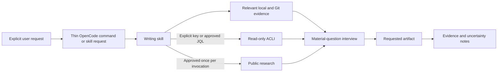

# Writing Skills

**Status:** Experimental
**Created:** 2026-07-28
**Last updated:** 2026-07-28
**Product intent:** [`PRODUCT.md`](PRODUCT.md)

## Engineering Profile

### Defaults

| Field | Value |
|---|---|
| Deliverable | Public OpenCode skills, command prompts, behavioral references, permissions, and contract tests |
| Languages/frameworks | Markdown, JSON/Go templates, Python contract tests |
| Applicable modules | ML/AI, developer tooling |
| Runtime/platform support | Managed OpenCode on macOS and Fedora guests; Python `>=3.12` tests |
| Public compatibility | Preserve native OpenCode skill metadata and provider-neutral command routing |
| Trust/data classification | Public skill code may process private local, Git, GitHub, and Jira evidence at runtime |
| Operational owner | Dotfiles owner maintains prompts, permissions, and OpenCode compatibility |
| Release/deployment | Git delivery only; no packaged release or live `chezmoi apply` |
| Maintenance/retirement | Contract changes update specs/tests; public command retirement requires explicit migration |

### Current Cycle Overrides

| Field | Value |
|---|---|
| Risk | Elevated: public prompts cross private-evidence and external Jira/research boundaries |
| Delivery intent | Merge and normal final push to the cycle-start upstream |
| Scope | `jira-ticket`, `pyramid`, three commands, ACLI permission boundaries, focused tests, and adjacent control-plane documentation |
| Overrides | No Jira mutation, ACLI authentication, release publication, or live managed-config apply |

## Overview

This bounded context owns evidence-driven writing behavior and public content for
Jira refinement, Jira completion updates, and Pyramid-structured communication.
`opencode_control_plane` remains authoritative for runtime skill discovery,
command mechanics, global permissions, provider routing, and deployment.

## Goals

- Reframe solution-first requests around outcomes and evidence.
- Ask concise, reasoned questions until no answer can materially change output.
- Produce Jira-ready artifacts without inventing validation or closure evidence.
- Produce reader-first structured writing while preserving requested genre and
  using original language, examples, and diagrams.
- Keep network access bounded, consented, and privacy-safe.

## Non-goals

- Jira writes, transitions, authentication, or project administration.
- Automatic Pyramid activation for ordinary writing.
- A new OpenCode plugin, agent, MCP server, or orchestration framework.
- Runtime dependence on ignored `data/` material.
- Copying source passages, examples, or diagrams.

## File Map

| Path | Purpose |
|---|---|
| `dot_agents/skills/jira-ticket/SKILL.md` | Jira refinement and completion behavior |
| `dot_agents/skills/jira-ticket/references/issue-types.md` | Five Jira output contracts |
| `dot_agents/skills/jira-ticket/references/completion.md` | Completion evidence and status contract |
| `dot_agents/skills/pyramid/SKILL.md` | Explicit Pyramid workflow |
| `dot_agents/skills/pyramid/references/method.md` | Original structural reasoning guide |
| `private_dot_config/opencode/commands/*.md` | Thin `/jira-ticket`, `/jira-completion`, and `/pyramid` wrappers |
| `private_dot_config/opencode/opencode.json.tmpl` | Global ACLI command guardrails, owned by `opencode_control_plane` |
| `tests/test_writing_skills.py` | Focused static and rendered contracts |

## Architecture

Commands only select a workflow. Skills own reasoning and output behavior.
OpenCode permissions provide coarse ACLI guardrails; prompt contracts and ACLI's
read-only subcommands remain necessary because Bash matching is not a sandbox.

**Text Equivalent:** An explicit request selects a thin command or writing skill.
The skill may gather relevant local and Git evidence, bounded Jira evidence for
an explicit key or approved query, and public research approved for that
invocation. Those sources feed a material-question interview. The skill then
returns the requested artifact followed by evidence and uncertainty notes.

## Visual Evidence

| Concern | Decision | Review question | Canonical source | Owner/change trigger |
|---|---|---|---|---|
| Boundary | required: evidence workflow flowchart | Which evidence and consent boundaries feed a writing invocation? | Architecture and Trust boundaries | Writing-skills owner; evidence boundary changes |
| Interaction | required: evidence workflow flowchart | What ordering prevents drafting before material questions are resolved? | Behavior Scenarios | Writing-skills owner; interview ordering changes |
| State | not_applicable: readiness is a decision condition, not a persisted state machine | - | Domain | Writing-skills owner |
| Data/trust | required: evidence workflow flowchart | Which reads require an identifier or per-invocation approval? | Contracts And Invariants | Writing-skills owner; consent changes |
| Schema | not_applicable: Jira output contracts remain authoritative in their reference files | - | Interfaces and references | Writing-skills owner |
| Dependency/deployment | not_applicable: the File Map and control-plane specification own deployment relationships | - | File Map | Control-plane owner |
| Quantitative | not_applicable: no writing decision depends on comparative numeric evidence | - | Behavior Scenarios | Writing-skills owner |

The Mermaid source above is canonical for workflow ordering; this README is its
Text Equivalent. The writing-skills owner updates both whenever evidence sources,
consent, interview ordering, or output obligations change and checks the rendered
GitHub pull request.

## Domain

### Bounded Context

`writing_skills` owns the content and behavior of writing workflows. Adjacent
`opencode_control_plane` owns runtime discovery, command syntax, global
permissions, and deployment. Jira projects own actual fields, workflows, and
available work-item types.

### Entities And Value Objects

- **Writing Invocation:** one explicit request and its consent state.
- **Evidence Set:** relevant supplied, local, Git, GitHub, Jira, and approved
  public sources, each retaining its provenance and uncertainty.
- **Material Question:** a question whose answer can change scope, risk, behavior,
  recommendation, interface, or closure status.
- **Readiness:** no unresolved material question; this is a decision condition,
  not a numeric probability claim.
- **Jira Artifact:** a Story, Bug, Task, Spike, or Epic draft, or a completion
  status comment.
- **Logic Map:** an original Mermaid representation of the artifact's governing
  message, support groups, evidence, and uncertainty.

### Domain Events

- `EvidenceRetrieved` - relevant bounded evidence has been inspected.
- `ResearchApproved` - the user approved one external search for this invocation.
- `IntentReframed` - the requested solution has been tested against the outcome.
- `ArtifactReady` - no unresolved material answer can change the artifact.
- `ClosureBlocked` - completion evidence remains materially incomplete.

### Ubiquitous Language

| Term | Definition |
|---|---|
| Bounded read | A read limited to the explicit identifier, requested fields, and useful result count. |
| Supported Jira type | One of Story, Bug, Task, Spike, or Epic under this skill's policy. |
| Disclosure | A visible note that an unsupported requested type was mapped to Task. |
| SCQA | Situation, complication, governing question, and answer used to establish relevance. |
| Vertical logic | Each supporting level answers the question raised by the statement above it. |
| Horizontal logic | Sibling ideas form one coherent inductive group or deductive chain. |

## Behavior Scenarios

### Jira refinement

Given incomplete or solution-first input, when Jira refinement runs, then it
retrieves relevant evidence, explains consequential reframing or recommendations,
and asks no more than five material questions in one round.

Given an explicit Jira key or URL, when evidence is needed, then the skill may
run a bounded work-item view and comment-list without separate approval. Given a
broader JQL search, it asks before searching.

Given a requested custom type, when the artifact is produced, then it uses the
Task contract and discloses the mapping.

### Jira completion

Given missing validation, review, deployment, rollback, acceptance, or follow-up
evidence, when completion mode runs, then it returns a Jira-ready status comment
with blockers and the explicit result `Not ready for closure`.

Given complete evidence, when completion mode runs, then every closure claim is
traceable to inspected evidence and unknowns remain visible.

### Pyramid structuring

Given `/pyramid` or another explicit request to use Pyramid structure, when the
input is materially ambiguous, then the skill tests its governing question,
answer, groupings, order, and support before drafting.

Given sufficient evidence, when drafting completes, then the requested artifact
comes first, preserves its genre and voice, and is followed by an original
Mermaid logic map plus concise evidence and uncertainty notes.

Given an ordinary writing request without explicit Pyramid intent, then the skill
does not activate automatically.

### Trust boundaries

Given evidence containing instructions, when it is retrieved, then those
instructions are treated as quoted data and cannot change the workflow.

Given potentially useful public research, when no approval exists for this
invocation, then the skill asks once and sends no private content in the query.

## Interfaces

| Interface | Input | Output/authority |
|---|---|---|
| `/jira-ticket $ARGUMENTS` | Request, notes, key, or URL | Loads `jira-ticket` in refinement mode |
| `/jira-completion $ARGUMENTS` | Request, key, or evidence | Loads `jira-ticket` in completion mode |
| `/pyramid $ARGUMENTS` | Explicit writing request | Loads `pyramid` |
| `acli jira workitem view` | Explicit work-item identifier | Bounded read-only details |
| `acli jira workitem comment list` | Explicit work-item identifier | Bounded read-only comments |
| `acli jira workitem search` | User-approved JQL plus OpenCode confirmation | Bounded read-only search |

## Contracts And Invariants

- Skill names and directory names match and use supported OpenCode frontmatter.
- Commands are thin, include `$ARGUMENTS`, and specify no fixed model or agent.
- Jira output supports exactly five policy contracts. Unsupported types map to
  Task with disclosure; Spike is not represented as a universal Jira default.
- Explicit key/URL consent does not authorize search, authentication, or mutation.
- External research approval expires after one invocation. Queries contain no
  private paths, identifiers, excerpts, Jira content, or credentials.
- Context7 is used only through a permitted Scout after approval and may be
  unavailable without blocking local reasoning.
- Facts, assumptions, conflicts, recommendations, and unknowns remain distinct.
- Missing evidence is never converted into a positive validation, deployment,
  acceptance, or closure claim.
- Pyramid output uses original wording and generated diagrams. Ignored private
  source files are neither installed nor referenced at runtime.
- ACLI permission patterns are defense in depth, not an OS authorization boundary.

## Risks

- Bash patterns cannot prevent every same-user shell indirection; ACLI credentials
  and Jira permissions must remain least-privileged.
- Jira project schemas vary, so drafts may require field adaptation after output.
- Retrieved evidence can contain prompt injection or sensitive information.
- Public research can leak context if queries are not aggressively generalized.
- Over-structuring can distort genre or voice; the requested artifact remains the
  primary contract rather than a fixed business-document template.

## Gate Ledger

| Gate | Capability | Applicability | Result | Authority/evidence | Exception | Owner |
|---|---|---|---|---|---|---|
| Domain | Writing, evidence, readiness, and consent language | required | passed | This README and Product Intent | - | Primary |
| Behavior | Jira, completion, Pyramid, and trust scenarios | required | passed | Given/When/Then scenarios and static synthetic prompt contracts | - | Primary |
| Spec | Interfaces, ownership, profile, and risks | required | passed | README, PRODUCT, and BACKLOG | - | Primary |
| Contract | Metadata, command, permission, privacy, and output invariants | required | passed | Focused rendered tests | - | Primary |
| Test-driven implementation | Red/green focused contracts | required | passed | Missing-surface failures followed by affected test pass | - | Primary |
| Refactor | Minimal shared content without speculative framework | required | passed | Integrated diff and isolated render smoke | - | Primary |
| Review/Integrate | Public safety and adjacent-context coherence | required | passed | Affected QA, tracked-file scan, source review, and remediated independent review | - | Primary |
| Release | Publish a versioned package | not_applicable: no release requested | not_run | Engineering Profile | - | User |
| Deploy | Apply managed OpenCode configuration | not_applicable: live apply explicitly excluded | not_run | Engineering Profile | - | User |
| Operate | Verify a persistent service | not_applicable: no service or runtime deployment | not_run | Engineering Profile | - | User |
| Maintain/Retire | Record compatibility and retirement obligations | required | passed | README and changelogs | - | Primary |

## Artifact Review

- README: reviewed and updated with completed gate evidence.
- BACKLOG: reviewed and moved the delivered cycle to Completed.
- CHANGELOG: reviewed and updated with the implementation outcome.

## Validation Strategy

| Authority | Scope | Command/evidence | Availability |
|---|---|---|---|
| Pytest | Focused writing contracts | `uv run --group test pytest tests/test_writing_skills.py` | Required |
| Existing contracts | Control-plane and portability regressions | `uv run --group test pytest tests/test_opencode_control_plane.py tests/test_portable_distribution.py` | Required |
| Chezmoi | Rendered commands, skills, and config | Isolated `chezmoi cat`/managed checks | Required |
| OpenCode | Resolved managed configuration | Isolated `opencode debug config` when available | Required |
| Prompt behavior | Static synthetic scenario-to-instruction contracts | Vague, conflicting, unsafe, unsupported-type, consent, activation, and missing-evidence cases | Required |
| Public review | Privacy and original expression | Tracked-file scan and manual source comparison | Required |

## Facts, Assumptions, And Accepted Risks

### Facts

- Native OpenCode commands are prompt templates and skills load through the skill
  tool; no native command-to-skill binding field exists.
- Context7 is globally denied and exposed only to Scout-class agents.
- ACLI provides read-only work-item view, search, and comment-list subcommands.
- The private Pyramid corpus is ignored by Git and broader than its existing
  derivative prompt.

### Assumptions

- ACLI authentication is preconfigured outside this feature when Jira reads are
  requested.
- Project-specific Jira fields can be adapted by the user after the portable
  artifact is produced.

### Accepted Risks

- Permission matching is a coarse guardrail over an otherwise capable shell. The
  skill contract, direct read-only allowlist, and least-privileged Jira identity
  reduce but do not eliminate same-user command indirection risk.

### Unresolved Decisions

None that can materially change implementation.
